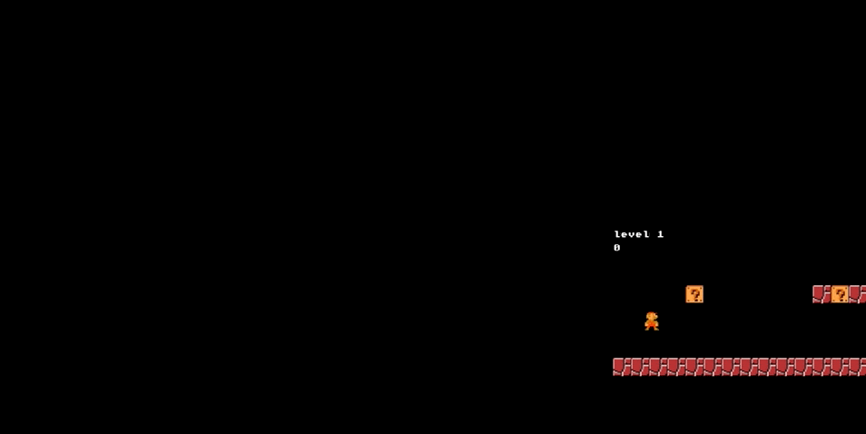

# README

## Overview
This is a simple Mario game with 5 levels built to learn Kaboom.js. I created the 
first two levels by following this [YouTube tutorial by Code with Ania Kubów](https://youtu.be/2nucjefSr6I). 

## Features 
- 5 levels of the game
- Mario player can jump, eat mushrooms and become big, collect coins, and kill
evil mushrooms
- Score is saved across each level 
- By going down a pipe, the Mario player reaches the next level! 

## Technologies
Languages:
- JavaScript
- HTML

Frameworks & Libraries:
-  Kaboom.js 